Analysis of Baccala Mantecato and Baccala alla Vicentina

## Package Loading and General Configuration


``` r
rm(list=ls())

library(readxl)
library(readr)
library(tidyverse)
library(dplyr)
library(ggplot2)
library(gridExtra)
library(lmtest)
library(mgcv)
library(forecast)
library(lmtest)
library(prophet)
library(gam)
```


``` r
source("Code/Functions_Utilies.R")
```

## Data Loading and Preprocessing


``` r
data <- read_csv("Data/data.csv")
data$Date <- as.Date(data$Date, format = "%Y-%m-%d") # ensure date format
data <- data %>% mutate(Month = format(Date, "%m"),
                        Year = as.factor(format(Date, "%Y"))) # create useful features for the models
data$trend <- 1:nrow(data)

head(data,3)
```

<div data-pagedtable="false">
  <script data-pagedtable-source type="application/json">
{"columns":[{"label":["Date"],"name":[1],"type":["date"],"align":["right"]},{"label":["Baccala_Mantecato"],"name":[2],"type":["dbl"],"align":["right"]},{"label":["Baccala_Vicentina"],"name":[3],"type":["dbl"],"align":["right"]},{"label":["Month"],"name":[4],"type":["chr"],"align":["left"]},{"label":["Year"],"name":[5],"type":["fct"],"align":["left"]},{"label":["trend"],"name":[6],"type":["int"],"align":["right"]}],"data":[{"1":"2021-01-01","2":"36.4","3":"6.1","4":"01","5":"2021","6":"1"},{"1":"2021-02-01","2":"36.4","3":"5.4","4":"02","5":"2021","6":"2"},{"1":"2021-03-01","2":"31.2","3":"6.1","4":"03","5":"2021","6":"3"}],"options":{"columns":{"min":{},"max":[10]},"rows":{"min":[10],"max":[10]},"pages":{}}}
  </script>
</div>

Check for missing values

``` r
colSums(is.na(data))
```

```
##              Date Baccala_Mantecato Baccala_Vicentina             Month 
##                 0                 0                 0                 0 
##              Year             trend 
##                 0                 0
```

Then we load a dataset found on [EUMOFA](https://eumofa.eu/web/guest/bulk-download).
We also tried incorporating different variables, such as the NIC for fish products (Istat), the production price of fish products (Istat), and others. However, these variables did not prove to be significantly relevant for our analysis.
Additionally, some other variables we tried do not have monthly data that match the frequency of the sales data we are working with, limiting their usefulness in the context of our time series analysis.

Here we focus on the salmon consumption only because we have seen that other fishes or their aggregate value lead worst results.

``` r
fish_cons <- read_excel("Data/Fish_consumption_ita_raw.xlsx") %>%
  filter(CG == "Salmon") %>%
  mutate(kg = as.numeric(`volume(Kg)`)) %>%
  group_by(year, month) %>%
  summarise(kg = sum(kg), .groups = "drop") %>%
  filter(year > 2020 | (year == 2020 & month %in% c(11, 12))) %>%
  mutate(
    kg_std = scale(kg),
    Date = as.Date(paste(year, month, "01", sep = "-"))
  )  %>%
  select(Date, kg, kg_std)

head(fish_cons, 3)
```

<div data-pagedtable="false">
  <script data-pagedtable-source type="application/json">
{"columns":[{"label":["Date"],"name":[1],"type":["date"],"align":["right"]},{"label":["kg"],"name":[2],"type":["dbl"],"align":["right"]},{"label":["kg_std"],"name":[3],"type":["dbl[,1]"],"align":["right"]}],"data":[{"1":"2020-11-01","2":"1943824","3":"0.8904992"},{"1":"2020-12-01","2":"2850563","3":"2.7444439"},{"1":"2021-01-01","2":"1803247","3":"0.6030702"}],"options":{"columns":{"min":{},"max":[10]},"rows":{"min":[10],"max":[10]},"pages":{}}}
  </script>
</div>

The dataset contains three columns:

Date: Unlike the data related to baccalà, the time series for salmon starts from November 2020. This is because we lack information for the last two months of 2024, so we applied a two-month lag. This choice also makes sense for future applications, as it would not be possible to forecast baccalà sales (whether mantecato or alla vicentina) for December when monthly consumption data for that month is already available.

kg_std: Represents the standardized version of the kg column. Since the values in kg are quite large, we opted to standardize them to simplify further analysis.

kg: Represents the quantity of salmon sold in Italy, measured in kilograms.

Finally we aggregate the salmon monthly consumption time series to our data.

``` r
data$fish_cons <- fish_cons$kg_std[,1]
head(data,3)
```

<div data-pagedtable="false">
  <script data-pagedtable-source type="application/json">
{"columns":[{"label":["Date"],"name":[1],"type":["date"],"align":["right"]},{"label":["Baccala_Mantecato"],"name":[2],"type":["dbl"],"align":["right"]},{"label":["Baccala_Vicentina"],"name":[3],"type":["dbl"],"align":["right"]},{"label":["Month"],"name":[4],"type":["chr"],"align":["left"]},{"label":["Year"],"name":[5],"type":["fct"],"align":["left"]},{"label":["trend"],"name":[6],"type":["int"],"align":["right"]},{"label":["fish_cons"],"name":[7],"type":["dbl"],"align":["right"]}],"data":[{"1":"2021-01-01","2":"36.4","3":"6.1","4":"01","5":"2021","6":"1","7":"0.8904992"},{"1":"2021-02-01","2":"36.4","3":"5.4","4":"02","5":"2021","6":"2","7":"2.7444439"},{"1":"2021-03-01","2":"31.2","3":"6.1","4":"03","5":"2021","6":"3","7":"0.6030702"}],"options":{"columns":{"min":{},"max":[10]},"rows":{"min":[10],"max":[10]},"pages":{}}}
  </script>
</div>

## Explanatory Analysis

First, we visualize the time series of Baccala Mantecato and Baccala Vicentina over time.
This plot helps us compare the trend of sales for both products on a monthly basis.

``` r
ggplot(data, aes(x = Date)) +
  geom_line(aes(y = Baccala_Mantecato, color = "Baccala Mantecato"), size = 1) +
  geom_line(aes(y = Baccala_Vicentina, color = "Baccala Vicentina"), size = 1) +
  labs(title = "Monthly Time Series of Baccala Mantecato and Baccala Vicentina",
       x = "Date",
       y = "Quantity") +
  scale_color_manual(values = c("Baccala Mantecato" = "#FF7F7F", "Baccala Vicentina" = "#6BC3FF")) +
  theme_minimal() +
  theme(legend.position = "bottom")
```

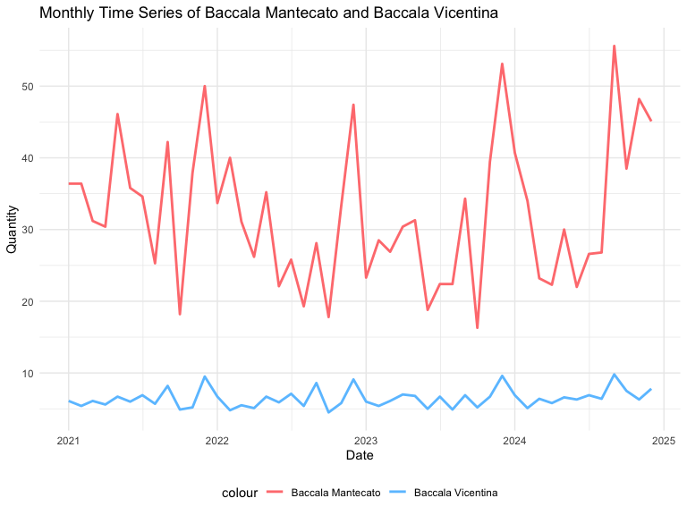<!-- -->

The sales quantities of Baccala Mantecato and Baccala Vicentina show significant differences, with Baccala Mantecato consistently having a much higher volume of sales throughout all periods observed. Additionally, Baccala Mantecato exhibits a much wider range of values, indicating greater variability in sales. In contrast, Baccala Vicentina appears more stable, with sales peaks typically occurring towards the end of the year. A similar trend is also seen for Baccala Mantecato, which experiences an uptick in sales during the final months of each year.

Next, we plot the time series for both products grouped by year.
The goal is to observe yearly trends and patterns for Baccala Mantecato and Baccala Vicentina separately.

``` r
plot1 <- ggplot(data, aes(x = Month, y = Baccala_Mantecato, color = Year, group = Year)) +
  geom_line() + 
  labs(x = "Month", y = "Baccala Mantecato", 
       title = "Monthly Time Series of Baccala Mantecato by Year") +
  theme_minimal() +
  theme(legend.title = element_blank())

plot2 <- ggplot(data, aes(x = Month, y = Baccala_Vicentina, color = Year, group = Year)) +
  geom_line() + 
  labs(x = "Month", y = "Baccala Vicentina", 
       title = "Monthly Time Series of Baccala Vicentina by Year") +
  theme_minimal() +
  theme(legend.title = element_blank())

grid.arrange(plot1, plot2, nrow = 2)
```

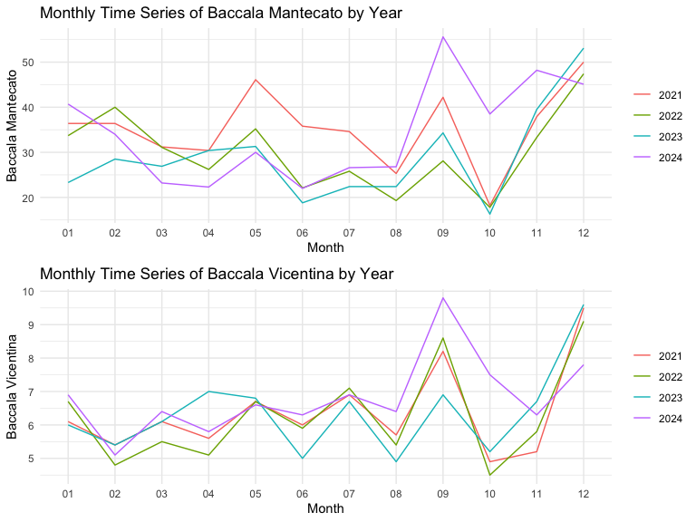<!-- -->

Both graphs highlight the pattern mentioned earlier: for each year, there is an increase in sales during the final months of the year, particularly in September and December. 
Additionally, regarding Baccala Mantecato, it appears that during the earlier years of sales for which we have data, the quantity sold was generally higher in the off-peak months (for example, the orange line for 2021 is higher compared to the other years). However, in the later years, the quantity sold during the peak months has increased.

Finally, we also examined the properties of the time series by plotting the autocorrelation functions (ACF).


``` r
ym = ts(data$Baccala_Mantecato, frequency = 12, start = c(2021, 1))
yv = ts(data$Baccala_Vicentina, frequency = 12, start = c(2021, 1))

if (end(ym)[1] != 2024 || end(ym)[2] != 12) {
  print("Error in ts ym")
}
if (end(yv)[1] != 2024 || end(yv)[2] != 12) {
  print("Error in ts yv")
}

tsdisplay(data$Baccala_Mantecato)
```

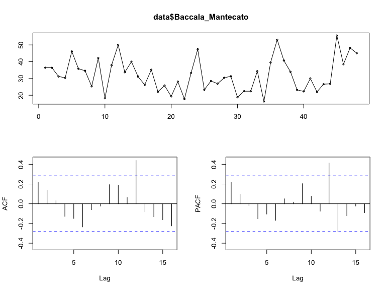<!-- -->

``` r
tsdisplay(data$Baccala_Vicentina)
```

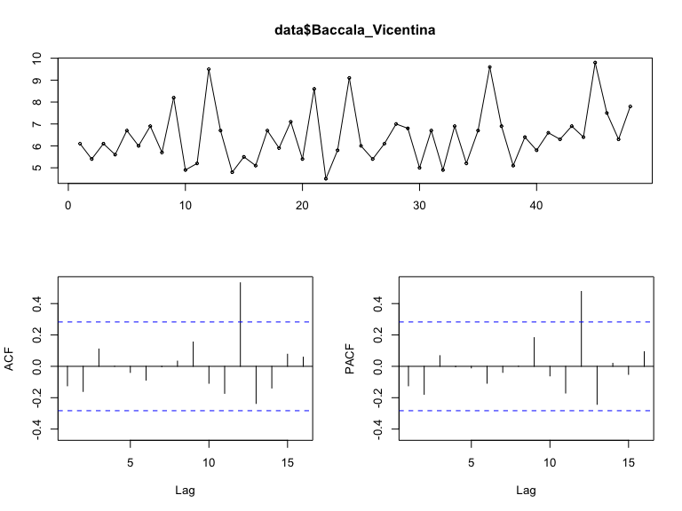<!-- -->

``` r
#Acf(data$Baccala_Mantecato, main = "ACF of Baccala Mantecato", col = "#FF7F7F", lwd = 2)
#Pcf(data$Baccala_Mantecato, main = "PACF of Baccala Mantecato", col = "#FF7F7F", lwd = 2)
#Acf(data$Baccala_Vicentina, main = "ACF of Baccala Vicentina", col = "#6BC3FF", lwd = 2)
#Pacf(data$Baccala_Vicentina, main = "PACF of Baccala Vicentina", col = "#6BC3FF", lwd = 2)
```

We now that autocorrelation occurs when the effect of a avriable is spread over time, in these cases, most of the autocorrelations fall within the confidence bands, indicating that the data does not show significant correlation for most lags. 
However, within the bands, the autocorrelations exhibit a sinusoidal pattern, suggesting the presence of seasonality in the data, where periodic fluctuations occur over time. The peak at lag 12 further supports the idea of a cyclical effect.
We will analyze the residuals of future models to confirm or disprove the presence of this seasonality.

## TRAIN/TEST SPLIT

In this section, we perform a train-test split to prepare the data for model training and evaluation. We divide the time series data for both Baccala Mantecato and Baccala Vicentina into training and testing sets, with 90% of the data allocated for training and the remaining 10% for testing.

``` r
prop <- 0.8

n_sample <- floor(nrow(data) * prop)
  
train <- data[1:n_sample, ]
y_trainm <- train[["Baccala_Mantecato"]]
y_trainv <- train[["Baccala_Vicentina"]]
  
test <- data[(n_sample + 1):nrow(data), ]
  
y_testm <- test[["Baccala_Mantecato"]]
y_testv <- test[["Baccala_Vicentina"]]
```


``` r
Type = c(rep("Train", dim(train)[1]), rep("Test", dim(test)[1]))
ggplot(data, aes(x = trend, y = Baccala_Mantecato, color = Type)) +
  geom_line(size = 1) +
  scale_color_manual(values = c("#FF7F7F", "#6BC3FF")) +
  labs(title = "Train and Test Data for Baccala Mantecato",
       x = "Time",
       y = "Quantity sold of Baccala Mantecato") +
  theme_minimal() +
  theme(legend.position = "bottom")
```

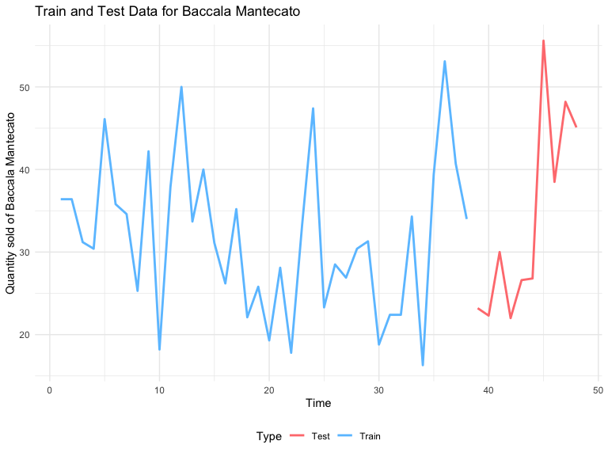<!-- -->

``` r
ggplot(data, aes(x = trend, y = Baccala_Vicentina, color = Type)) +
  geom_line(size = 1) +
  scale_color_manual(values = c("#FF7F7F", "#6BC3FF")) +
  labs(title = "Train and Test Data for Baccala Vicentina",
       x = "Time",
       y = "Quantity sold of Baccala Vicentina") +
  theme_minimal() +
  theme(legend.position = "bottom")
```

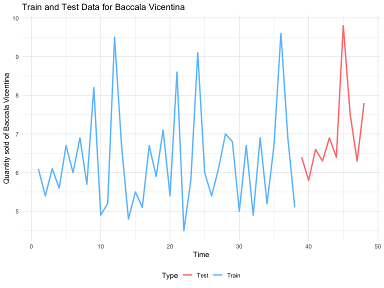<!-- -->

## Modelling Phase

### Linear Regression Model

#### Baccala Mantecato
We start by estimating a simple linear regression model with all the possible variables

``` r
lr_m <- lm(Baccala_Mantecato ~ trend + Month + fish_cons, data = train)
summary(lr_m)
```

```
## 
## Call:
## lm(formula = Baccala_Mantecato ~ trend + Month + fish_cons, data = train)
## 
## Residuals:
##     Min      1Q  Median      3Q     Max 
## -4.7655 -1.9233 -0.1261  1.5838  5.2790 
## 
## Coefficients:
##              Estimate Std. Error t value Pr(>|t|)    
## (Intercept)  28.76483    2.33754  12.306 7.41e-12 ***
## trend         0.17966    0.07826   2.296 0.030739 *  
## Month02     -12.02497    3.23351  -3.719 0.001069 ** 
## Month03      -2.76863    2.52651  -1.096 0.284028    
## Month04      -3.83513    2.51453  -1.525 0.140284    
## Month05       3.59937    2.50358   1.438 0.163434    
## Month06      -3.31292    2.63052  -1.259 0.219991    
## Month07       2.11136    2.84382   0.742 0.465027    
## Month08      -7.16741    2.58442  -2.773 0.010563 *  
## Month09       7.26070    2.67281   2.717 0.012042 *  
## Month10     -10.51947    2.64547  -3.976 0.000559 ***
## Month11      -3.59240    2.82306  -1.273 0.215379    
## Month12      14.82343    2.55508   5.802 5.56e-06 ***
## fish_cons     7.79469    1.31187   5.942 3.93e-06 ***
## ---
## Signif. codes:  0 '***' 0.001 '**' 0.01 '*' 0.05 '.' 0.1 ' ' 1
## 
## Residual standard error: 3.275 on 24 degrees of freedom
## Multiple R-squared:  0.9178,	Adjusted R-squared:  0.8732 
## F-statistic: 20.61 on 13 and 24 DF,  p-value: 6.729e-10
```

The Multiple R-squared value of 0.9178 indicates that approximately 91.78% of the variability in Baccala_Mantecato is explained by the model.
Then we take a closer look to the coefficents:
- the trend variable has a positive coefficient of 0.18, meaning that, on average, Baccala_Mantecato increases by 0.18 units for each time period, assuming all other factors remain constant.
-The coefficient for fish_cons is 7.79, indicating a strong positive relationship. Specifically, for each unit increase in fish consumption, Baccala_Mantecato rises by approximately 7.79 units. In particular we will provide an exemple: if the fish consumption in Italy increases by a unit in October 2021, then keeping all the other variables fixed, the quantity sold in December 2021 will increase of 7.79 kg.
- Regarding the Month variables, they capture seasonal effects by representing deviations from the baseline month (January). Some months show statistically significant effects (e.g., February, August, September, October, and December. For example, December shows a substantial positive effect, indicating a peak in that month, while months like February and October have negative coefficients, reflecting significant declines compared to January.

Now we try removing variables to evaluate their impact on model performance using AIC and adjusted R² values.


``` r
#lr_m_<missing_variable>
lr_m_month <- lm(Baccala_Mantecato ~ trend + fish_cons, data = train)
lr_m_trend <- lm(Baccala_Mantecato ~ Month + fish_cons, data = train)
lr_m_fish_cons <- lm(Baccala_Mantecato ~ trend + Month, data = train)

cat("Model with trend and fish consumption:\n")
```

```
## Model with trend and fish consumption:
```

``` r
cat("  AIC:", AIC(lr_m_month), "\n")
```

```
##   AIC: 268.4855
```

``` r
cat("  Adjusted R²:", summary(lr_m_month)$adj.r.squared, "\n\n")
```

```
##   Adjusted R²: 0.2875235
```

``` r
cat("Model with trend and month:\n")
```

```
## Model with trend and month:
```

``` r
cat("  AIC:", AIC(lr_m_fish_cons), "\n")
```

```
##   AIC: 242.9203
```

``` r
cat("  Adjusted R²:", summary(lr_m_fish_cons)$adj.r.squared, "\n\n")
```

```
##   Adjusted R²: 0.6992935
```

``` r
cat("Model with month and fish consumption:\n")
```

```
## Model with month and fish consumption:
```

``` r
cat("  AIC:", AIC(lr_m_trend), "\n")
```

```
##   AIC: 216.0883
```

``` r
cat("  Adjusted R²:", summary(lr_m_trend)$adj.r.squared, "\n\n")
```

```
##   Adjusted R²: 0.8515828
```

``` r
cat("Full model:\n")
```

```
## Full model:
```

``` r
cat("  AIC:", AIC(lr_m), "\n")
```

```
##   AIC: 210.5452
```

``` r
cat("  Adjusted R²:", summary(lr_m)$adj.r.squared, "\n")
```

```
##   Adjusted R²: 0.8732335
```
As we can expect by the summary of the full model, from the AIC and Adjusted R² results we clearly see that the best model fit belong to the full model with all predictors: trend, monthly seasonality and fish consumption.

Finally we will analyze the residuals.

``` r
resid_lr <- residuals(lr_m)
mse_train_lrm <- mean(resid_lr^2)
#checkresiduals(lr_m)
tsdisplay(resid_lr)
```

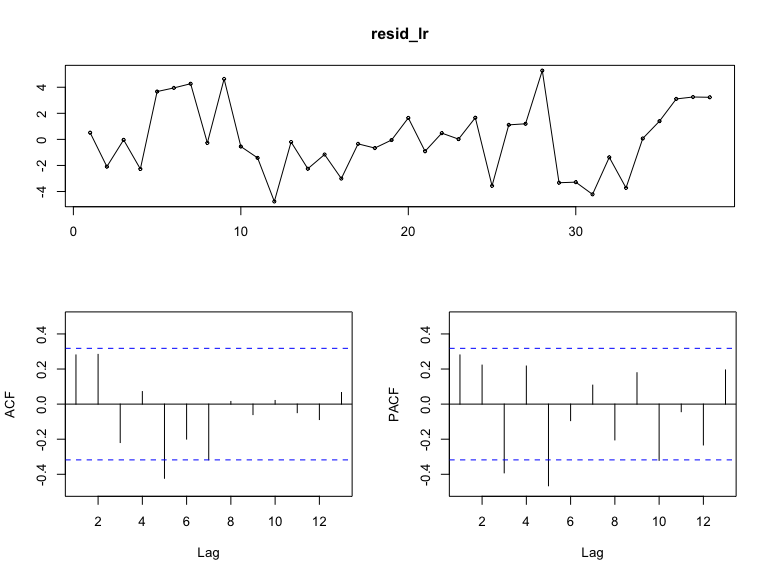<!-- -->


``` r
dwtest(lr_m)
```

```
## 
## 	Durbin-Watson test
## 
## data:  lr_m
## DW = 1.3979, p-value = 0.03549
## alternative hypothesis: true autocorrelation is greater than 0
```

When we analyze the residuals of the linear regression model, as shown in the plot below, we observe no particular patterns. The residuals appear to be randomly scattered, indicating that the model has appropriately captured the underlying trends in the data. This suggests that the assumptions of linearity, constant variance, and independence are reasonably satisfied, and the model's fit is adequate for forecasting purposes. 
We also perform the Durbin-Watson test, that is used to check for autocorrelation in the residuals of a regression model.
Since the p-value is smaller than the significance level (0.05), we don't reject the null hypothesis that the autocorrelation of the disturbances is 0.

Finally we plot the predicted values and the actual ones. We also compute the MSE on the test set.


``` r
ggplot() +
  geom_line(aes(x = data$Date, y = data$Baccala_Mantecato, color = "Actual Values"), size = 1) +
  geom_line(aes(x = train$Date, y = fitted(lr_m), color = "Fitted Values (Train)"), size = 1) +
  geom_line(aes(x = test$Date, y = predict(lr_m, newdata = test), color = "Predicted Values (Test)"), size = 1) + 
  scale_color_manual(values = c("Actual Values" = "#FF7F7F", 
                                "Fitted Values (Train)" = "#6BC3FF", 
                                "Predicted Values (Test)" = "#8FBC8F"),
                     labels = c("Actual Values", "Fitted Values (Train)", "Predicted Values (Test)")) +
  
  labs(
    title = "Actual vs Fitted and Predicted Values for Baccala Mantecato (Linear Regression Model)",
    x = "Date",
    y = "Value",
    color = "Legend"
  ) +
  theme_minimal() +
  theme(legend.position = "bottom")
```

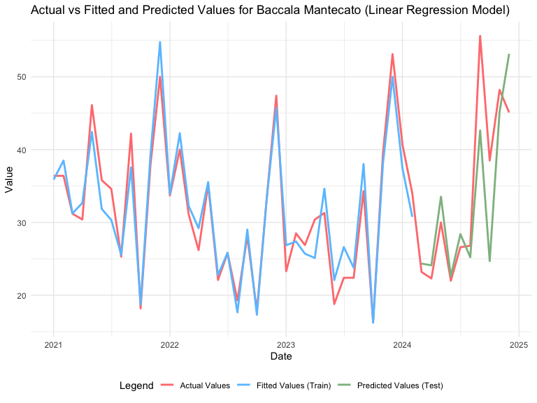<!-- -->

``` r
mse_test_lrm <- mse(predict(lr_m, newdata = test), test$Baccala_Mantecato)
print(mse_test_lrm)
```

```
## [1] 45.59531
```

#### Baccala Vicentina

The same analysis is conducted below for the Baccala Vicentina variable.


``` r
lr_v_full <- lm(Baccala_Vicentina ~ trend + Month + fish_cons, data = train)
summary(lr_v_full)
```

```
## 
## Call:
## lm(formula = Baccala_Vicentina ~ trend + Month + fish_cons, data = train)
## 
## Residuals:
##      Min       1Q   Median       3Q      Max 
## -0.93656 -0.28770  0.03834  0.26048  1.04389 
## 
## Coefficients:
##              Estimate Std. Error t value Pr(>|t|)    
## (Intercept)  6.521439   0.385732  16.907 7.81e-15 ***
## trend       -0.003871   0.012914  -0.300 0.766943    
## Month02     -1.024427   0.533581  -1.920 0.066832 .  
## Month03     -0.545658   0.416915  -1.309 0.202997    
## Month04     -0.539178   0.414939  -1.299 0.206145    
## Month05      0.313648   0.413131   0.759 0.455128    
## Month06     -0.871432   0.434079  -2.008 0.056078 .  
## Month07      0.338424   0.469276   0.721 0.477776    
## Month08     -1.159240   0.426472  -2.718 0.011995 *  
## Month09      1.376043   0.441056   3.120 0.004660 ** 
## Month10     -1.650578   0.436545  -3.781 0.000915 ***
## Month11     -0.403319   0.465851  -0.866 0.395189    
## Month12      3.009990   0.421629   7.139 2.23e-07 ***
## fish_cons   -0.132469   0.216480  -0.612 0.546344    
## ---
## Signif. codes:  0 '***' 0.001 '**' 0.01 '*' 0.05 '.' 0.1 ' ' 1
## 
## Residual standard error: 0.5405 on 24 degrees of freedom
## Multiple R-squared:  0.8872,	Adjusted R-squared:  0.8261 
## F-statistic: 14.52 on 13 and 24 DF,  p-value: 2.521e-08
```

This time the fish consumption seems to be not useful to imporve the model pefromance so we remove it


``` r
lr_v <- update(lr_v_full, .~. - fish_cons)
summary(lr_v)
```

```
## 
## Call:
## lm(formula = Baccala_Vicentina ~ trend + Month, data = train)
## 
## Residuals:
##     Min      1Q  Median      3Q     Max 
## -1.0267 -0.2963  0.0500  0.2662  1.0733 
## 
## Coefficients:
##              Estimate Std. Error t value Pr(>|t|)    
## (Intercept)  6.382778   0.308227  20.708  < 2e-16 ***
## trend        0.002222   0.008120   0.274  0.78658    
## Month02     -1.252222   0.377455  -3.318  0.00278 ** 
## Month03     -0.516111   0.408896  -1.262  0.21852    
## Month04     -0.518333   0.408331  -1.269  0.21599    
## Month05      0.312778   0.407927   0.767  0.45041    
## Month06     -0.789444   0.407685  -1.936  0.06420 .  
## Month07      0.475000   0.407604   1.165  0.25488    
## Month08     -1.093889   0.407685  -2.683  0.01274 *  
## Month09      1.470556   0.407927   3.605  0.00136 ** 
## Month10     -1.565000   0.408331  -3.833  0.00076 ***
## Month11     -0.533889   0.408896  -1.306  0.20355    
## Month12      2.963889   0.409621   7.236 1.39e-07 ***
## ---
## Signif. codes:  0 '***' 0.001 '**' 0.01 '*' 0.05 '.' 0.1 ' ' 1
## 
## Residual standard error: 0.5337 on 25 degrees of freedom
## Multiple R-squared:  0.8854,	Adjusted R-squared:  0.8305 
## F-statistic:  16.1 on 12 and 25 DF,  p-value: 7.211e-09
```

The adjusted R² increses from 0.8261 to 0.8305 suggesting that the reduced model is better than the full one. 
Furthermore, the trend variable shows a large p-value, suggesting that it can be removed from the model without significantly affecting the results.


``` r
lr_v <- update(lr_v, .~. - trend)
summary(lr_v)
```

```
## 
## Call:
## lm(formula = Baccala_Vicentina ~ Month, data = train)
## 
## Residuals:
##     Min      1Q  Median      3Q     Max 
## -1.0000 -0.3187  0.0500  0.2562  1.1000 
## 
## Coefficients:
##             Estimate Std. Error t value Pr(>|t|)    
## (Intercept)   6.4250     0.2620  24.518  < 2e-16 ***
## Month02      -1.2500     0.3706  -3.373 0.002339 ** 
## Month03      -0.5250     0.4003  -1.312 0.201133    
## Month04      -0.5250     0.4003  -1.312 0.201133    
## Month05       0.3083     0.4003   0.770 0.448076    
## Month06      -0.7917     0.4003  -1.978 0.058647 .  
## Month07       0.4750     0.4003   1.187 0.246096    
## Month08      -1.0917     0.4003  -2.727 0.011289 *  
## Month09       1.4750     0.4003   3.685 0.001058 ** 
## Month10      -1.5583     0.4003  -3.893 0.000618 ***
## Month11      -0.5250     0.4003  -1.312 0.201133    
## Month12       2.9750     0.4003   7.432 6.84e-08 ***
## ---
## Signif. codes:  0 '***' 0.001 '**' 0.01 '*' 0.05 '.' 0.1 ' ' 1
## 
## Residual standard error: 0.5241 on 26 degrees of freedom
## Multiple R-squared:  0.8851,	Adjusted R-squared:  0.8365 
## F-statistic: 18.21 on 11 and 26 DF,  p-value: 1.684e-09
```


The best model for the Baccala Vicentina series is the one that includes only the monthly seasonality. This model provides the best fit, indicating that the variations in the data are primarily driven by seasonal effects, without the need for additional trend or other predictors.
Moreover, the fitted model is statistically significant, as shown by the F-statistic of 18.21, with a p-value of 1.684e-09, confirming the model's overall significance.

Below, we compare the difference in AIC and adjusted R² between the full model and the one with only the monthly seasonality.


``` r
cat("Model with month:\n")
```

```
## Model with month:
```

``` r
cat("  AIC:", AIC(lr_v), "\n")
```

```
##   AIC: 70.31701
```

``` r
cat("  Adjusted R²:", summary(lr_v)$adj.r.squared, "\n\n")
```

```
##   Adjusted R²: 0.8364892
```

``` r
cat("Full model:\n")
```

```
## Full model:
```

``` r
cat("  AIC:", AIC(lr_v_full), "\n")
```

```
##   AIC: 73.61503
```

``` r
cat("  Adjusted R²:", summary(lr_v_full)$adj.r.squared, "\n")
```

```
##   Adjusted R²: 0.8261056
```

The model with only the monthly seasonality performs better than the full model in terms of both AIC and adjusted R².

Finally we will analyze the residuals.


``` r
resid_lrv <- residuals(lr_v)
mse_train_lrv <- mean(resid_lrv^2)
#checkresiduals(lr_v)
tsdisplay(resid_lrv)
```

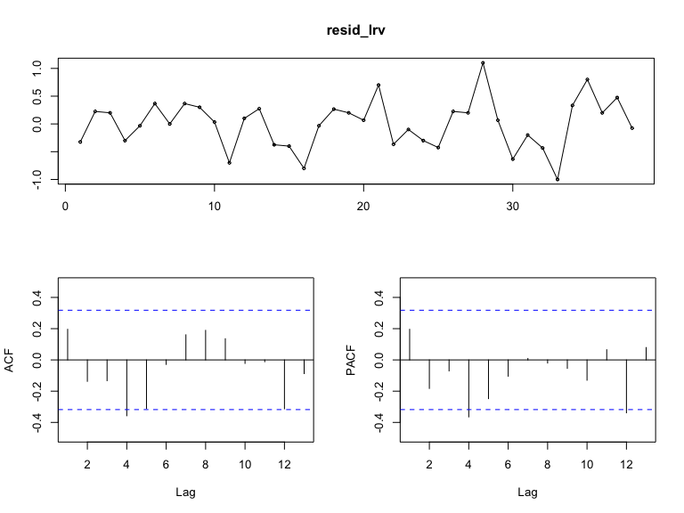<!-- -->


``` r
dwtest(lr_v)
```

```
## 
## 	Durbin-Watson test
## 
## data:  lr_v
## DW = 1.5926, p-value = 0.18
## alternative hypothesis: true autocorrelation is greater than 0
```

The Durbin-Watson test, that is used to check for autocorrelation in the residuals of a regression model.mSince the p-value is greater than the significance level (0.05), we reject the null hypothesis.

Finally we plot the predicted values and the actual ones. We also compute the MSE on the test set.

``` r
ggplot() +
  geom_line(aes(x = data$Date, y = data$Baccala_Vicentina, color = "Actual Values"), size = 1) +
  geom_line(aes(x = train$Date, y = fitted(lr_v), color = "Fitted Values (Train)"), size = 1) +
  geom_line(aes(x = test$Date, y = predict(lr_v, newdata = test), color = "Predicted Values (Test)"), size = 1) + 
  scale_color_manual(values = c("Actual Values" = "#FF7F7F", 
                                "Fitted Values (Train)" = "#6BC3FF", 
                                "Predicted Values (Test)" = "#8FBC8F"),
                     labels = c("Actual Values", "Fitted Values (Train)", "Predicted Values (Test)")) +
  labs(
    title = "Actual vs Fitted and Predicted Values for Baccala Vicentina (Linear Regression Model)",
    x = "Date",
    y = "Value",
    color = "Legend"
  ) +
  theme_minimal() +
  theme(legend.position = "bottom")
```

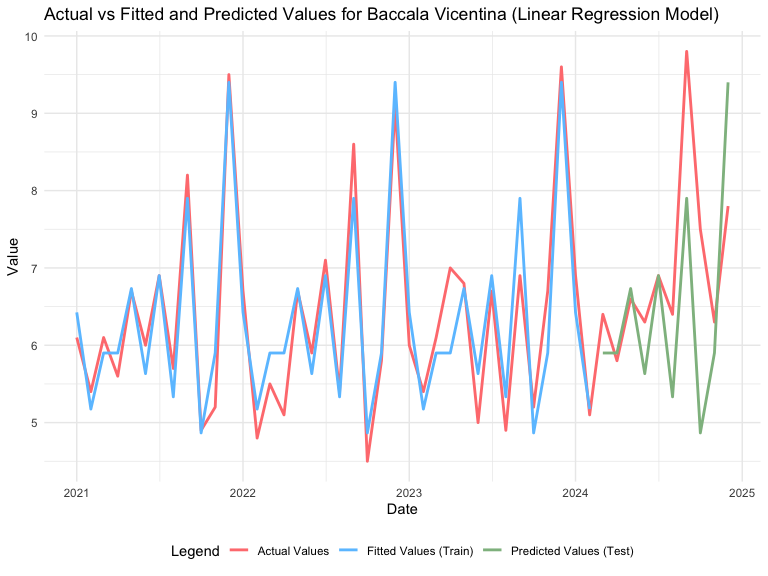<!-- -->

``` r
mse_test_lrv <- mse(predict(lr_v, newdata = test), test$Baccala_Vicentina)
print(mse_test_lrv)
```

```
## [1] 1.512444
```

### GAM Models
#### Baccala Mantecato
Now we explore if we can benefit from non-linear models, in particular we try a GAM model and compare it with the Multiple Linear Regression selected model.
We start from the LR model

``` r
g0 = gam(Baccala_Mantecato ~ trend + Month + fish_cons, data = train) #this is equivalent to lr_m
```

Now we plot the linear effects to see if they may require smoothing functions

``` r
par(mfrow=c(1,2))
plot(g0)
```

```
## Warning in gplot.default(x = c("01", "02", "03", "04", "05", "06", "07", : The
## "x" component of "partial for Month" has class "character"; no gplot() methods
## available
```

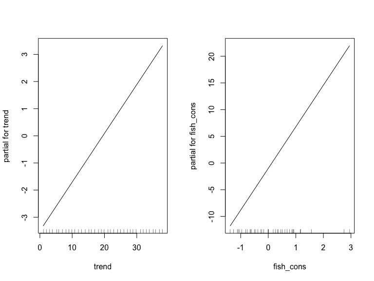<!-- -->

We clearly see a perfectly linear relation between the predictors and the response variable, this plots suggests to stop our non-linear analysis. To be sure we try anyway to include smoothing variables

``` r
g1 <- gam(Baccala_Mantecato ~ s(trend, df=2) + Month + s(fish_cons, df=2), data = train)
summary(g1)
```

```
## 
## Call: gam(formula = Baccala_Mantecato ~ s(trend, df = 2) + Month + 
##     s(fish_cons, df = 2), data = train)
## Deviance Residuals:
##      Min       1Q   Median       3Q      Max 
## -4.15544 -1.31407 -0.09549  1.61239  5.67812 
## 
## (Dispersion Parameter for gaussian family taken to be 9.2934)
## 
##     Null Deviance: 3131.195 on 37 degrees of freedom
## Residual Deviance: 204.4537 on 21.9999 degrees of freedom
## AIC: 205.7842 
## 
## Number of Local Scoring Iterations: NA 
## 
## Anova for Parametric Effects
##                      Df  Sum Sq Mean Sq F value    Pr(>F)    
## s(trend, df = 2)      1   57.33  57.329  6.1687    0.0211 *  
## Month                11 2353.98 213.998 23.0269 1.498e-09 ***
## s(fish_cons, df = 2)  1  314.04 314.042 33.7919 7.550e-06 ***
## Residuals            22  204.45   9.293                      
## ---
## Signif. codes:  0 '***' 0.001 '**' 0.01 '*' 0.05 '.' 0.1 ' ' 1
## 
## Anova for Nonparametric Effects
##                      Npar Df Npar F   Pr(F)  
## (Intercept)                                  
## s(trend, df = 2)           1 1.7976 0.19369  
## Month                                        
## s(fish_cons, df = 2)       1 3.3753 0.07973 .
## ---
## Signif. codes:  0 '***' 0.001 '**' 0.01 '*' 0.05 '.' 0.1 ' ' 1
```

Based on the df and on the 'Anova for Nonparametric Effects' results, where the nonparametric F-values for s(trend) and s(fish_cons) are not statistically significant (with p-values of 0.19369 and 0.07973 respectively), it is clear that these variables do not exhibit nonlinear relationships with the response variable as we initially expected. Therefore, for reasons of parsimony, interpretability, and simplicity, we exclude the GAM model in favor of a straightforward multiple linear regression model, which aligns better with the data and offers more meaningful results.

#### Baccala Vicentina 
Let's see if the same holds for Baccala_Vicentina.

``` r
g0_v = gam(Baccala_Vicentina ~ trend + Month + fish_cons, data = train) #this is equivalent to lr_v_full (remember that the best one was lr_v (only Month as X))

par(mfrow=c(1,2))
plot(g0)
```

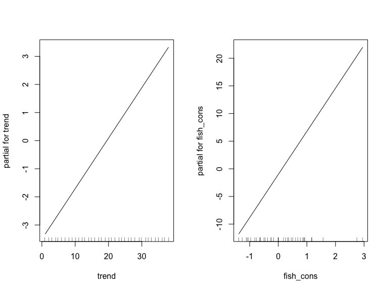<!-- -->

we clearly see that the behaviour of the explenatory variables is still linear. 
This suggests to keep the linear regression model, but we have also seen, in the section dedicated to linear regression, that for Baccala_Vicentina the best model was the reduced one obtained by considering only the Month variable as predictor. 
So we keep it.

This analysis clearly indicates that both results suggest against the use of models that fit nonlinear relationships, such as GAMs.


### SARIMA Model

#### Baccala Mantecato

To begin, we first transform the sales data of Baccala Mantecato into a time series object:


``` r
ts_m <- ts(train$Baccala_Mantecato, start = c(2021, 01), frequency = 12)
plot.ts(ts_m)
```

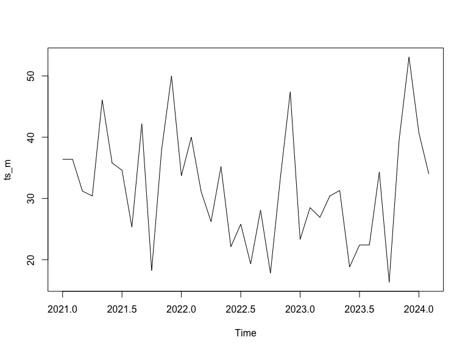<!-- -->
From the plot above and the significance of the trend coefficient in the regression model discussed in the previous section, we might consider taking the first difference to observe the behavior of the ACF and PACF.


``` r
ts_m1 <- diff(ts_m,1)
tsdisplay(diff(ts_m,1))
```

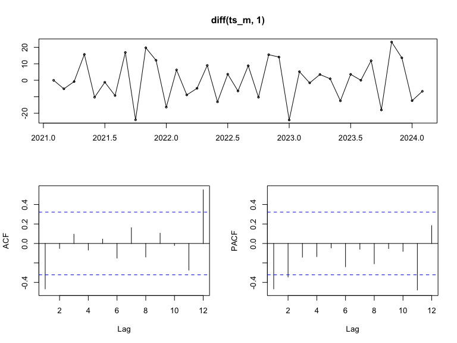<!-- -->

``` r
#Acf(ts_m1, main = "ACF of Baccala Mantecato with Lag 1", col = "#FF7F7F", lwd = 2)
#Pacf(ts_m1, main = "PACF of Baccala Mantecato with Lag 1", col = "#6BC3FF", lwd = 2)
```


Both the ACF and PACF plots show a sinusoidal pattern, with all values falling within the confidence bands, except for a significant spike at lag 12. 
This suggests that a SARIMA model with a seasonal period s=12, accounting for monthly data with yearly seasonality, might be appropriate for this time series.


``` r
ts_m_12 <- diff(ts_m, lag = 12)
tsdisplay(diff(ts_m, lag = 12))
```

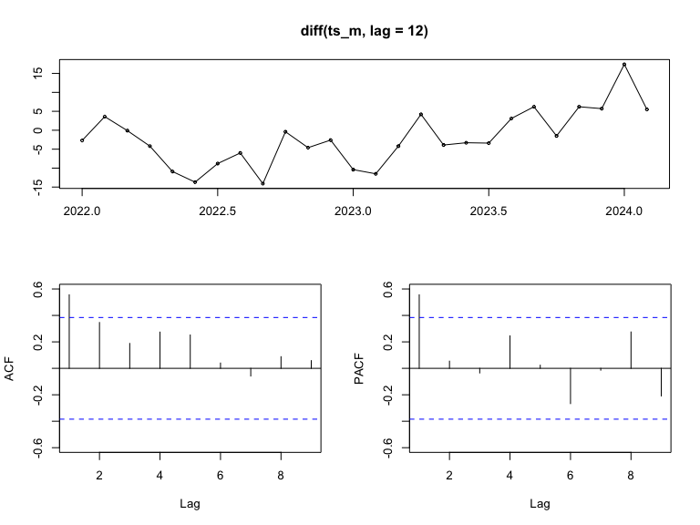<!-- -->

``` r
#Acf(ts_m_12, main = "ACF of Baccala Mantecato with Lag 12", col = "#FF7F7F", lwd = 2)
#Pacf(ts_m_12, main = "PACF of Baccala Mantecato with Lag 12", col = "#6BC3FF", lwd = 2)
```

Now, we will build three SARIMA models. The first model will incorporate a non-seasonal differencing (with d=1), one autoregressive term (AR(1)), and a seasonal differencing with a period of 12 (to account for the yearly seasonality). The second model will instead include a moving average (MA(1)) term along with the differencing. The last one only incorporate the differencing.


``` r
# SARIMA (1,1,0)(0,1,0)[12]
sarima_model1m <- Arima(ts_m, order=c(1,1,0), seasonal=c(0,1,0))
summary(sarima_model1m)
```

```
## Series: ts_m 
## ARIMA(1,1,0)(0,1,0)[12] 
## 
## Coefficients:
##           ar1
##       -0.4026
## s.e.   0.1950
## 
## sigma^2 = 40.08:  log likelihood = -81.19
## AIC=166.38   AICc=166.92   BIC=168.81
## 
## Training set error measures:
##                     ME     RMSE      MAE      MPE     MAPE      MASE
## Training set 0.4121828 5.031449 3.569755 0.974692 13.28395 0.5866855
##                     ACF1
## Training set -0.04953755
```

``` r
# SARIMA (0,1,1)(0,1,0)[12]
sarima_model2m <- Arima(ts_m, order=c(0,1,1), seasonal=c(0,1,0))
summary(sarima_model2m)
```

```
## Series: ts_m 
## ARIMA(0,1,1)(0,1,0)[12] 
## 
## Coefficients:
##           ma1
##       -0.5335
## s.e.   0.1759
## 
## sigma^2 = 37.53:  log likelihood = -80.44
## AIC=164.89   AICc=165.43   BIC=167.33
## 
## Training set error measures:
##                     ME     RMSE      MAE      MPE   MAPE      MASE       ACF1
## Training set 0.5566444 4.868457 3.307765 1.377379 11.934 0.5436276 0.01044316
```

``` r
# SARIMA (0,1,0)(0,1,0)[12]
sarima_model3m <- Arima(ts_m, order=c(0,1,0), seasonal=c(0,1,0))
summary(sarima_model3m)
```

```
## Series: ts_m 
## ARIMA(0,1,0)(0,1,0)[12] 
## 
## sigma^2 = 45.23:  log likelihood = -83.12
## AIC=168.24   AICc=168.42   BIC=169.46
## 
## Training set error measures:
##                     ME     RMSE      MAE       MPE     MAPE      MASE
## Training set 0.2132482 5.455083 3.737677 0.7053902 13.76125 0.6142832
##                    ACF1
## Training set -0.3595701
```


``` r
mse(test$Baccala_Mantecato, forecast(sarima_model1m, h = length(y_testm))$mean)
```

```
## [1] 126.6163
```

``` r
mse(test$Baccala_Mantecato, forecast(sarima_model2m, h = length(y_testm))$mean)
```

```
## [1] 117.978
```

``` r
mse_test_sarimam <- mse(test$Baccala_Mantecato, forecast(sarima_model3m, h = length(y_testm))$mean)
mse_test_sarimam
```

```
## [1] 104.505
```


Based on the AIC values, the SARIMA(0,1,1)(0,1,0)[12] model is the better model. It has a lower AIC compared to the other SARIMA models. By the way, evaluating the performance on the test set, we notice that the MSE is larger for the AIC best model, while the SARIMA(0,1,0)(0,1,0)[12] perform better on the test set. We decide to continue whit the last one.


``` r
ggplot() +
  geom_line(aes(x = data$Date, y = data$Baccala_Mantecato, color = "Actual Values"), size = 1) +
  geom_line(aes(x = train$Date, y = fitted(sarima_model3m), color = "Fitted Values (Train)"), size = 1) +
  geom_line(aes(x = test$Date, y = forecast(sarima_model3m, h = nrow(test))$mean, 
                color = "Predicted Values (Test)"), size = 1) +
  scale_color_manual(values = c("Actual Values" = "#FF7F7F", 
                                "Fitted Values (Train)" = "#6BC3FF", 
                                "Predicted Values (Test)" = "#8FBC8F"),
                     labels = c("Actual Values", "Fitted Values (Train)", "Predicted Values (Test)")) +
  labs(
    title = "Actual vs Fitted and Predicted Values for Baccala Vicentina (SARIMA Model)",
    x = "Date",
    y = "Value",
    color = "Legend"
  ) +
  theme_minimal() +
  theme(legend.position = "bottom")
```

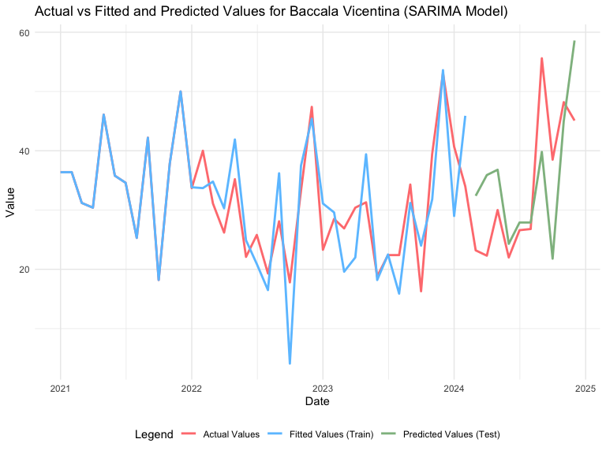<!-- -->


``` r
resid3 <- residuals(sarima_model3m)
mse_train_sarimam <- mean(resid3^2)
tsdisplay(resid3)
```

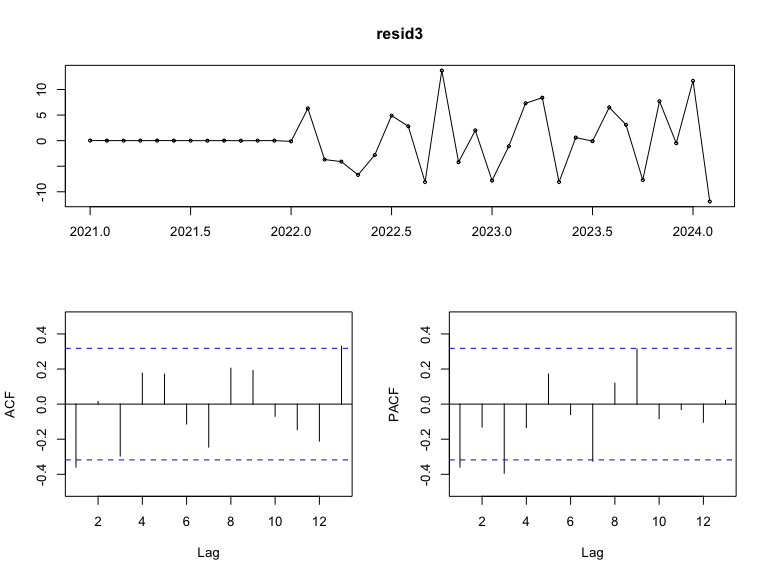<!-- -->

``` r
#Acf(resid3, main = "ACF for SARIMA Residuals of Baccala Mantecato", col = "#FF7F7F", lwd = 2)
#Pacf(resid3, main = "PACF for SARIMA Residuals of Baccala Mantecato", col = "#6BC3FF", lwd = 2)
```

Residuals does not suggest a really good fit but, as said before, the best test performance are reached by the selected model.

#### Baccala Vicentina

To begin, we first transform the sales data of Baccalá Vicentina into a time series object:


``` r
ts_v <- ts(train$Baccala_Vicentina, start = c(2021, 01), frequency = 12)
plot.ts(ts_v)
```

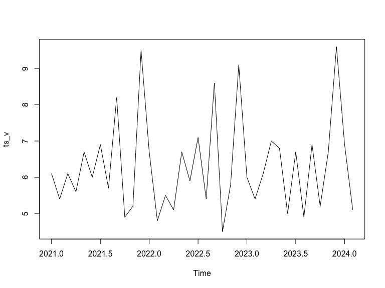<!-- -->


``` r
tsdisplay(ts_v)
```

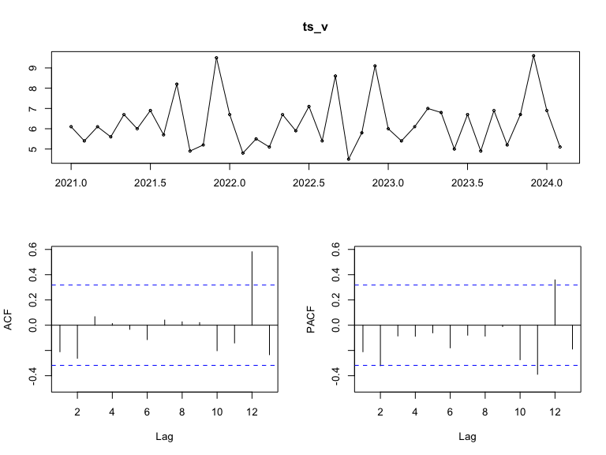<!-- -->

``` r
Acf(ts_v, main = "ACF of Baccala Vicentina", col = "#FF7F7F", lwd = 2)
```

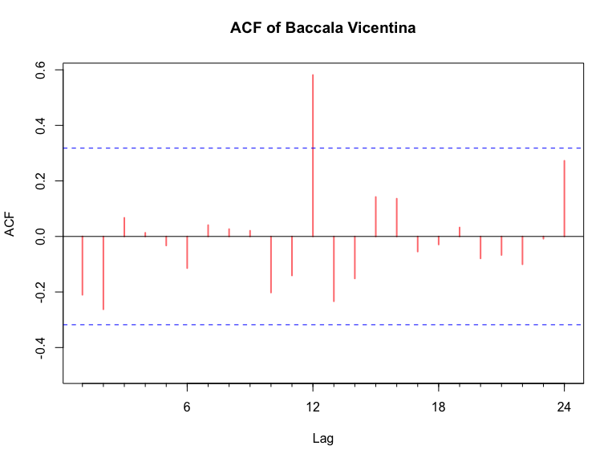<!-- -->

``` r
Pacf(ts_v, main = "PACF of Baccala Vicentina", col = "#6BC3FF", lwd = 2)
```

<!-- -->

From the plot above we clearly notice the presence of seasonality that is confirmed by the pacf and acf functions with a significant spike at lag 12.


``` r
ts_v_12 <- diff(ts_v, lag = 12)
tsdisplay(ts_v_12)
```

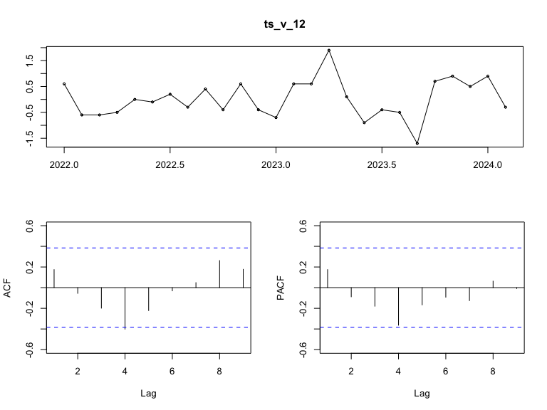<!-- -->

``` r
Acf(ts_v_12, main = "ACF of Baccala Vicentina with Lag 12", col = "#FF7F7F", lwd = 2)
```

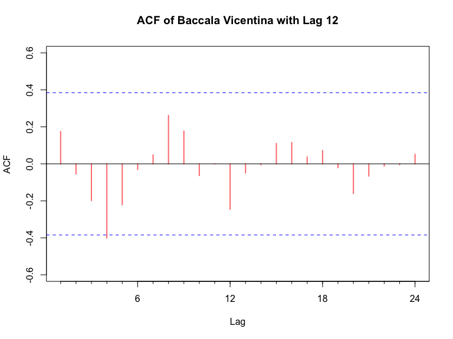<!-- -->

``` r
Pacf(ts_v_12, main = "PACF of Baccala Vicentina with Lag 12", col = "#6BC3FF", lwd = 2)
```

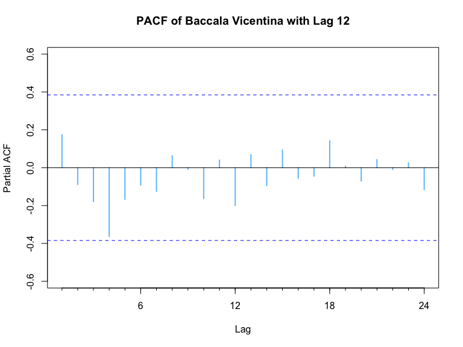<!-- -->

This suggests that a SARIMA model with a seasonal period s=12, accounting for monthly data with yearly seasonality, might be appropriate for this time series.

Now, we will build a SARIMA model model that incorporate only a seasonal differencing with a period of 12.
The parameter D=2 lead us to lower AIC but a bigger mse, this is a case of overfitting.


``` r
auto_sarima_modelv <- auto.arima(ts_v)
summary(auto_sarima_modelv)
```

```
## Series: ts_v 
## ARIMA(0,0,0)(0,1,0)[12] 
## 
## sigma^2 = 0.5269:  log likelihood = -28.56
## AIC=59.13   AICc=59.29   BIC=60.38
## 
## Training set error measures:
##                      ME      RMSE       MAE        MPE     MAPE      MASE
## Training set 0.01779737 0.6004495 0.4072711 -0.1956312 6.652206 0.6876005
##                   ACF1
## Training set 0.1744926
```

``` r
# SARIMA(0,0,0)(0,1,0)[12]
sarima_model2v <- Arima(ts_v, order=c(0,0,0), seasonal=c(0,1,0))
summary(sarima_model2v)
```

```
## Series: ts_v 
## ARIMA(0,0,0)(0,1,0)[12] 
## 
## sigma^2 = 0.5269:  log likelihood = -28.56
## AIC=59.13   AICc=59.29   BIC=60.38
## 
## Training set error measures:
##                      ME      RMSE       MAE        MPE     MAPE      MASE
## Training set 0.01779737 0.6004495 0.4072711 -0.1956312 6.652206 0.6876005
##                   ACF1
## Training set 0.1744926
```


``` r
resid2 <- residuals(sarima_model2v)
mse_train_sarimav <- mean(resid2^2)
tsdisplay(resid2)
```

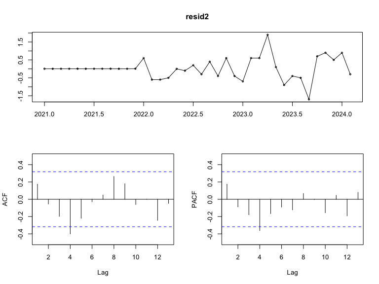<!-- -->

``` r
#Acf(resid2, main = "ACF for SARIMA Residuals of Baccala Vicentina", col = "#FF7F7F", lwd = 2)
#Pacf(resid2, main = "PACF for SARIMA Residuals of Baccala Vicentina", col = "#6BC3FF", lwd = 2)
```

The best model based on AIC is supposed to be the SARIMA(0,0,0)(0,1,0)[12].


``` r
mse_test_sarimav <- mse(test$Baccala_Vicentina, forecast(sarima_model2v, h = length(y_testv))$mean)
mse_test_sarimav
```

```
## [1] 2.265
```

Note: We also tried different configurations, expecially after we saw the residuals plot, where most of the values are inside the bandswith butfrom the ts plot their behaviou don't seems to be a random noise one; but at the end, this remain the best model. possible.


``` r
ggplot() +
  geom_line(aes(x = data$Date, y = data$Baccala_Vicentina, color = "Actual Values"), size = 1) +
  geom_line(aes(x = train$Date, y = fitted(sarima_model2v), color = "Fitted Values (Train)"), size = 1) +
  geom_line(aes(x = test$Date, y = forecast(sarima_model2v, h = nrow(test))$mean, 
                color = "Predicted Values (Test)"), size = 1) +
  scale_color_manual(values = c("Actual Values" = "#FF7F7F", 
                                "Fitted Values (Train)" = "#6BC3FF", 
                                "Predicted Values (Test)" = "#8FBC8F"),
                     labels = c("Actual Values", "Fitted Values (Train)", "Predicted Values (Test)")) +
  labs(
    title = "Actual vs Fitted and Predicted Values for Baccala Vicentina (SARIMA Model)",
    x = "Date",
    y = "Value",
    color = "Legend"
  ) +
  theme_minimal() +
  theme(legend.position = "bottom")
```

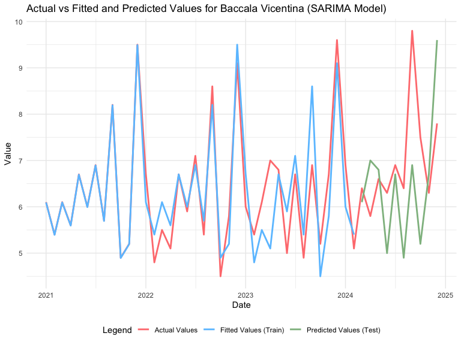<!-- -->
### ARMAX

Now following the same reasoning of SARIMA models, we compare to them the same models but also using the fish consumption information as xreg, to see if it improves our results

####Baccalà mantecato


``` r
sarimax_model1m <- Arima(ts_m, order = c(1, 1, 0), seasonal = c(0, 1, 0), xreg = train$fish_cons)
sarimax_model2m <- Arima(ts_m, order = c(0, 1, 1), seasonal = c(0, 1, 0), xreg = train$fish_cons)
sarimax_model3m <- Arima(ts_m, order = c(0, 1, 0), seasonal = c(0, 1, 0), xreg = train$fish_cons)
```

Once we have fitted the models, we compare them to the previous SARIMA considering the AIC as metric

``` r
AIC(sarima_model1m, sarimax_model1m)
```

<div data-pagedtable="false">
  <script data-pagedtable-source type="application/json">
{"columns":[{"label":[""],"name":["_rn_"],"type":[""],"align":["left"]},{"label":["df"],"name":[1],"type":["dbl"],"align":["right"]},{"label":["AIC"],"name":[2],"type":["dbl"],"align":["right"]}],"data":[{"1":"2","2":"166.3764","_rn_":"sarima_model1m"},{"1":"3","2":"143.8121","_rn_":"sarimax_model1m"}],"options":{"columns":{"min":{},"max":[10]},"rows":{"min":[10],"max":[10]},"pages":{}}}
  </script>
</div>

``` r
AIC(sarima_model2m, sarimax_model2m)
```

<div data-pagedtable="false">
  <script data-pagedtable-source type="application/json">
{"columns":[{"label":[""],"name":["_rn_"],"type":[""],"align":["left"]},{"label":["df"],"name":[1],"type":["dbl"],"align":["right"]},{"label":["AIC"],"name":[2],"type":["dbl"],"align":["right"]}],"data":[{"1":"2","2":"164.8879","_rn_":"sarima_model2m"},{"1":"3","2":"144.8067","_rn_":"sarimax_model2m"}],"options":{"columns":{"min":{},"max":[10]},"rows":{"min":[10],"max":[10]},"pages":{}}}
  </script>
</div>

``` r
AIC(sarima_model3m, sarimax_model3m)
```

<div data-pagedtable="false">
  <script data-pagedtable-source type="application/json">
{"columns":[{"label":[""],"name":["_rn_"],"type":[""],"align":["left"]},{"label":["df"],"name":[1],"type":["dbl"],"align":["right"]},{"label":["AIC"],"name":[2],"type":["dbl"],"align":["right"]}],"data":[{"1":"1","2":"168.2416","_rn_":"sarima_model3m"},{"1":"2","2":"151.9159","_rn_":"sarimax_model3m"}],"options":{"columns":{"min":{},"max":[10]},"rows":{"min":[10],"max":[10]},"pages":{}}}
  </script>
</div>

It is clear that using the fish consumption data we improve the models, but as we've seen for SARIMAs, considering only AIC may not be enough, so now we also look at the MSEs

``` r
mse(test$Baccala_Mantecato, forecast(sarima_model1m, h = length(y_testm))$mean)
```

```
## [1] 126.6163
```

``` r
mse(test$Baccala_Mantecato, forecast(sarimax_model1m, h = length(y_testm),xreg = test$fish_cons)$mean)
```

```
## [1] 64.51161
```

``` r
mse(test$Baccala_Mantecato, forecast(sarima_model2m, h = length(y_testm))$mean)
```

```
## [1] 117.978
```

``` r
mse(test$Baccala_Mantecato, forecast(sarimax_model2m, h = length(y_testm),xreg = test$fish_cons)$mean)
```

```
## [1] 64.29656
```

``` r
mse(test$Baccala_Mantecato, forecast(sarima_model3m, h = length(y_testm))$mean)
```

```
## [1] 104.505
```

``` r
mse_test_sarimaxm <- mse(test$Baccala_Mantecato, forecast(sarimax_model3m, h = length(y_testm),xreg = test$fish_cons)$mean)
mse_test_sarimaxm
```

```
## [1] 64.05571
```

We see that in terms of MSE, SARIMAX brings to huge improvements for all 3 the considered models reducing the MSEs by approximately 50%. 
Following the same reasoning as before, and considering both the AIC and the MSE, among the models we select the ARMAX(0,1,0)(0,1,0)[12].

Now we look at that model prediction on the test set compared to the respective original SARIMA

``` r
ggplot() +
  geom_line(aes(x = data$Date, y = data$Baccala_Mantecato, color = "Actual Values"), size = 1) +
  geom_line(aes(x = test$Date, y = forecast(sarima_model3m, h = nrow(test))$mean, 
                color = "Predicted Values (Test) SARIMA"), size = 1) +
  geom_line(aes(x = test$Date, y = forecast(sarimax_model3m, h = nrow(test), xreg = test$fish_cons)$mean, 
                color = "Predicted Values (Test) SARIMAX"), size = 1) +
  scale_color_manual(values = c("Actual Values" = "black", 
                                "Predicted Values (Test) SARIMA" = "#6BC3FF",
                                "Predicted Values (Test) SARIMAX" = "#FF7F7F"),
                     labels = c("Actual Values", "Predicted Values (Test) SARIMA", "Predicted Values (Test) SARIMAX")) +
  labs(
    title = "Actual vs Predicted Values for Baccala Mantecato (SARIMA vs SARIMAX)",
    x = "Date",
    y = "Value",
    color = "Legend"
  ) +
  theme_minimal() +
  theme(legend.position = "bottom")
```

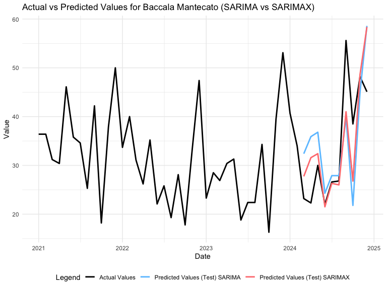<!-- -->

From the plot we clearly see the improvement obtained with the SARIMAX version, confirming that the fish_cons variable helps on predicting future orders quantity.

Now we see the residuals 

``` r
resid3_sarimax <- residuals(sarimax_model3m)
mse_train_sarimaxm <- mean(resid3_sarimax^2)
tsdisplay(resid3_sarimax, main="SARIMAX(0,1,0)(0,1,0)[12] Residuals for Baccala Mantecato")
```

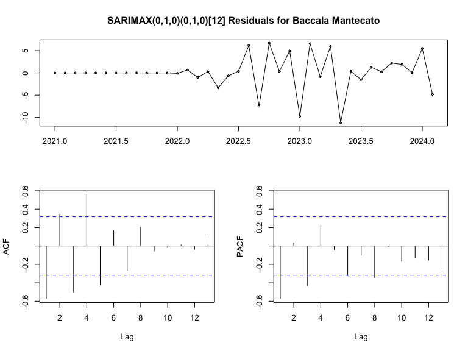<!-- -->

``` r
#Acf(resid3_sarimax, main = "ACF for SARIMAX Residuals of Baccala Mantecato", col = "#FF7F7F", lwd = 2)
#Pacf(resid3_sarimax, main = "PACF for SARIMAX Residuals of Baccala Mantecato", col = "#6BC3FF", lwd = 2)
```

From the acf we have the doubt that we are missing an autoregressive component, but including it leads to lower performances on the test set, so we decide to accept that loss of information showed in the residuals to avoid overfitting.

#### Baccala Vicentina
Following the same approach, we try to study the effects of considering fish_cons on Baccala_vicentina and compare it to the previously selected SARIMA(0,1,1)(0,1,0)[12] model

``` r
sarimax_model2v <- Arima(ts_v, order = c(0, 1, 1), seasonal = c(0, 1, 0), xreg = train$fish_cons)

AIC(sarima_model2v, sarimax_model2v)
```

```
## Warning in AIC.default(sarima_model2v, sarimax_model2v): models are not all
## fitted to the same number of observations
```

<div data-pagedtable="false">
  <script data-pagedtable-source type="application/json">
{"columns":[{"label":[""],"name":["_rn_"],"type":[""],"align":["left"]},{"label":["df"],"name":[1],"type":["dbl"],"align":["right"]},{"label":["AIC"],"name":[2],"type":["dbl"],"align":["right"]}],"data":[{"1":"1","2":"59.12659","_rn_":"sarima_model2v"},{"1":"3","2":"64.19084","_rn_":"sarimax_model2v"}],"options":{"columns":{"min":{},"max":[10]},"rows":{"min":[10],"max":[10]},"pages":{}}}
  </script>
</div>

``` r
mse(test$Baccala_Vicentina, forecast(sarima_model2v, h = length(y_testv))$mean)
```

```
## [1] 2.265
```

``` r
mse_test_sarimaxv <- mse(test$Baccala_Vicentina, forecast(sarimax_model2v, h = length(y_testv), xreg = test$fish_cons)$mean)
mse_test_sarimaxv
```

```
## [1] 2.349442
```

Surprisingly for the Baccala_Vicentina, the originally selected SARIMA model performs better than the SARIMAX one considering both AIC and MSE, so we discard it and select the original SARIMA.

``` r
ggplot() +
  geom_line(aes(x = data$Date, y = data$Baccala_Vicentina, color = "Actual Values"), size = 1) +
  geom_line(aes(x = test$Date, y = forecast(sarima_model2v, h = nrow(test))$mean, 
                color = "Predicted Values (Test) SARIMA"), size = 1) +
  geom_line(aes(x = test$Date, y = forecast(sarimax_model2v, h = nrow(test), xreg = test$fish_cons)$mean, 
                color = "Predicted Values (Test) SARIMAX"), size = 1) +
  scale_color_manual(values = c("Actual Values" = "black", 
                                "Predicted Values (Test) SARIMA" = "#6BC3FF",
                                "Predicted Values (Test) SARIMAX" = "#FF7F7F"),
                     labels = c("Actual Values", "Predicted Values (Test) SARIMA", "Predicted Values (Test) SARIMAX")) +
  labs(
    title = "Actual vs Predicted Values for Baccala Vicentina (SARIMA vs SARIMAX)",
    x = "Date",
    y = "Value",
    color = "Legend"
  ) +
  theme_minimal() +
  theme(legend.position = "bottom")
```

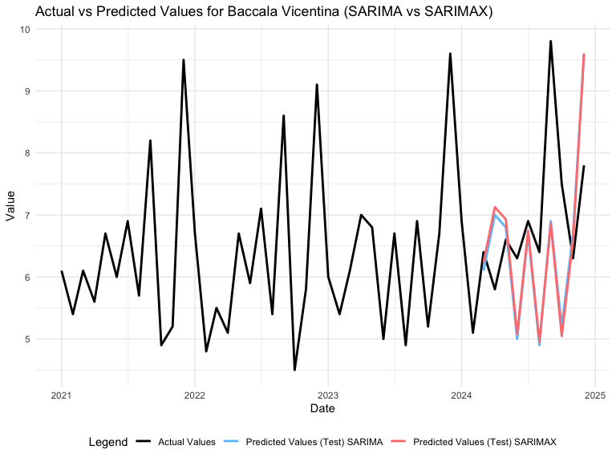<!-- -->

``` r
resid2_sarimax <- residuals(sarimax_model2v)
mse_train_sarimaxv <- mean(resid2_sarimax^2)
```
As we can see from the plot, the 2 predictions are very similar but probably fish_cons and the peak that occurs every December except for the last one, which coincidentally is the test set, lead the SARIMAX model to overestimate the quantities sold, thus explaining the worse results in terms of AIC and MSE obtained earlier. So we confirm that for Baccala_Vicentina we discard the SARIMAX model.


### Prophet Model

#### Baccala Mantecato
We start by creating the dataset to give to the function prophet()


``` r
proph_md <- data.frame(
  ds = train[,"Date"],
  y = train[,"Baccala_Mantecato"]
)
colnames(proph_md) <- c("ds", "y")
proph_md$cap <- max(proph_md$y) * 1.1
str(proph_md)
```

```
## 'data.frame':	38 obs. of  3 variables:
##  $ ds : Date, format: "2021-01-01" "2021-02-01" ...
##  $ y  : num  36.4 36.4 31.2 30.4 46.1 35.8 34.6 25.3 42.2 18.2 ...
##  $ cap: num  58.4 58.4 58.4 58.4 58.4 ...
```


``` r
proph_logistic=prophet(proph_md,  growth="logistic", n.changepoints=5, 
           yearly.seasonality=TRUE, 
           seasonality.mode='multiplicative')

proph_m=prophet(proph_md,  growth="linear", n.changepoints=5, 
           yearly.seasonality=TRUE, 
           seasonality.mode='multiplicative')

future_logistic <- make_future_dataframe(proph_logistic, periods = 10, freq = "month", include_history = T)
future_logistic$cap <- max(proph_md$y) * 1.1
forecast_future_logistic <- predict(proph_logistic, future_logistic)
test_logistic <- tail(forecast_future_logistic, 10)

mean((test$Baccala_Mantecato - test_logistic$yhat)^2)
```

```
## [1] 147.1989
```

``` r
future <- make_future_dataframe(proph_m, periods = 10, freq = "month", include_history = T)
future$cap <- max(proph_md$y) * 1.1
forecast_future <- predict(proph_m, future_logistic)
test_m <- tail(forecast_future, 10)

mse_test_prm <- mean((test$Baccala_Mantecato - test_m$yhat)^2)
mse_test_prm
```

```
## [1] 119.073
```

Visualize the rpedictions below.

``` r
forecast_future$y_true <- data$Baccala_Mantecato
forecast_future <- forecast_future[,c("yhat", "ds", "y_true")]

ggplot() +
  geom_line(aes(x = data$Date, y = forecast_future$y_true, color = "Actual Values"), size = 1) +
  geom_line(aes(x = train$Date, y = head(forecast_future,38)$yhat, 
                color = "Fitted Values (Train)"), size = 1) +
  geom_line(aes(x = test$Date, y = tail(forecast_future,10)$yhat, 
                color =  "Predicted Values (Test)"), size = 1) +
  scale_color_manual(values = c("Actual Values" = "#FF7F7F", 
                                "Fitted Values (Train)" = "#6BC3FF", 
                                "Predicted Values (Test)" = "#8FBC8F"),
                     labels = c("Actual Values", "Fitted Values (Train)", "Predicted Values (Test)")) +
  
  labs(
    title = "Actual vs Fitted and Predicted Values for Baccala Mantecato (Prophet Model)",
    x = "Date",
    y = "Value",
    color = "Legend"
  ) +
  theme_minimal() +
  theme(legend.position = "bottom")
```

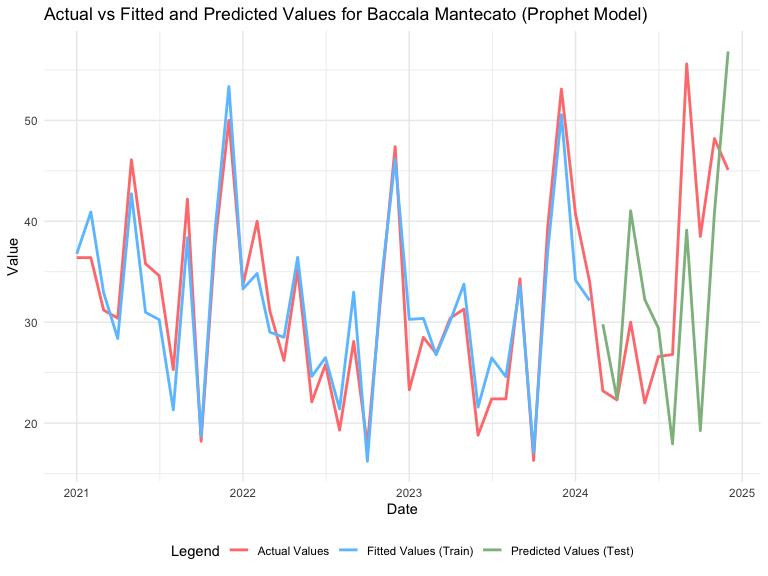<!-- -->

We observed the same staff of other models, the mse value (we will perfrom a final comparison between all the models) is high and looking at the plot, we are not able to fit well the function under the data.

``` r
res_proph <- train$Baccala_Mantecato - head(forecast_future$yhat, 38)
mse_train_prm <- mean(res_proph^2)
#checkresiduals(res_proph)
tsdisplay(res_proph)
```

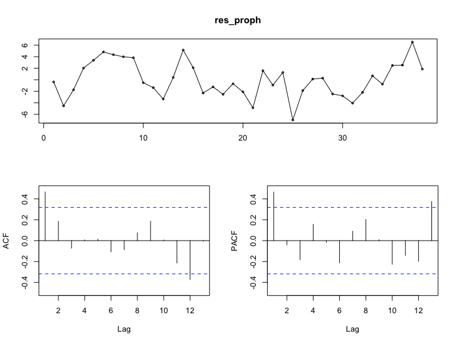<!-- -->

``` r
aar1 <- Arima(res_proph, order=c(1,0,0))# didn't help-->seasonal=list(order=c(0,1,0),period=12))

res_proph1 <- train$Baccala_Mantecato - (head(forecast_future$yhat, 38) + fitted(aar1))
mse_train_prm1 <- mean(res_proph1^2)
mse_train_prm1
```

```
## [1] 7.206331
```

``` r
#checkresiduals(res_proph)
tsdisplay(res_proph1)
```

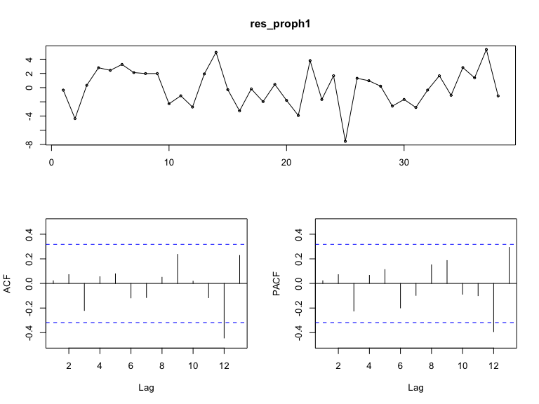<!-- -->

``` r
mean((test$Baccala_Mantecato - (test_m$yhat + as.numeric(forecast(aar1, h=10)$mean)))^2)
```

```
## [1] 120.7406
```

#### Baccala Vicentina


``` r
library(prophet)

proph_vd <- data.frame(
  ds = train[,"Date"],
  y = train[,"Baccala_Vicentina"]
)
colnames(proph_vd) <- c("ds", "y")
proph_vd$cap <- max(proph_vd$y) * 1.1
str(proph_vd)
```

```
## 'data.frame':	38 obs. of  3 variables:
##  $ ds : Date, format: "2021-01-01" "2021-02-01" ...
##  $ y  : num  6.1 5.4 6.1 5.6 6.7 6 6.9 5.7 8.2 4.9 ...
##  $ cap: num  10.6 10.6 10.6 10.6 10.6 ...
```


``` r
proph_logistic=prophet(proph_vd,  growth="logistic", n.changepoints=5, 
           yearly.seasonality=TRUE, 
           seasonality.mode='multiplicative')

proph_v=prophet(proph_vd,  growth="linear", n.changepoints=5, 
           yearly.seasonality=TRUE, 
           seasonality.mode='multiplicative')

future_logistic <- make_future_dataframe(proph_logistic, periods = 10, freq = "month", include_history = T)
future_logistic$cap <- max(proph_vd$y) * 1.1
forecast_future_logistic <- predict(proph_logistic, future_logistic)
test_logistic <- tail(forecast_future_logistic, 10)

mean((test$Baccala_Vicentina - test_logistic$yhat)^2)
```

```
## [1] 1.904377
```

``` r
future <- make_future_dataframe(proph_v, periods = 10, freq = "month", include_history = T)
future$cap <- max(proph_vd$y) * 1.1
forecast_future <- predict(proph_v, future_logistic)
test_v <- tail(forecast_future, 10)

mse_test_prv <- mean((test$Baccala_Vicentina - test_v$yhat)^2)
mse_test_prv
```

```
## [1] 1.842281
```


``` r
forecast_future$y_true <- data$Baccala_Vicentina
forecast_future <- forecast_future[,c("yhat", "ds", "y_true")]

ggplot() +
  geom_line(aes(x = data$Date, y = forecast_future$y_true, color = "Actual Values"), size = 1) +
  geom_line(aes(x = train$Date, y = head(forecast_future,38)$yhat, 
                color = "Fitted Values (Train)"), size = 1) +
  geom_line(aes(x = test$Date, y = tail(forecast_future,10)$yhat, 
                color =  "Predicted Values (Test)"), size = 1) +
  scale_color_manual(values = c("Actual Values" = "#FF7F7F", 
                                "Fitted Values (Train)" = "#6BC3FF", 
                                "Predicted Values (Test)" = "#8FBC8F"),
                     labels = c("Actual Values", "Fitted Values (Train)", "Predicted Values (Test)")) +
  
  labs(
    title = "Actual vs Fitted and Predicted Values for Baccala Vicentina (Prophet Model)",
    x = "Date",
    y = "Value",
    color = "Legend"
  ) +
  theme_minimal() +
  theme(legend.position = "bottom")
```

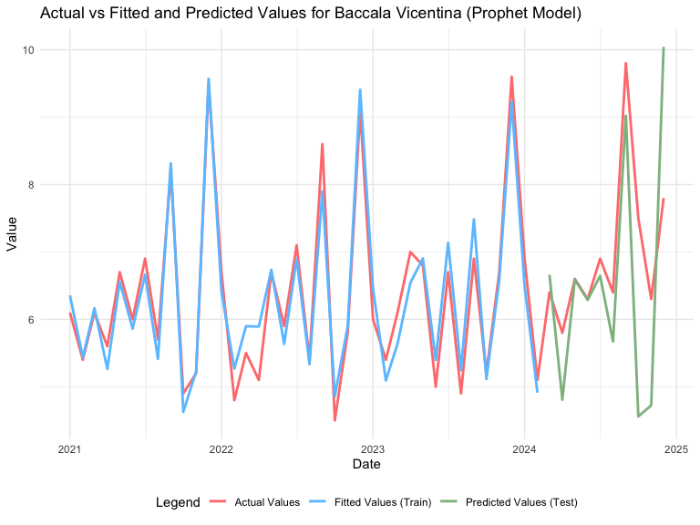<!-- -->


``` r
res_proph <- train$Baccala_Vicentina - head(forecast_future$yhat, 38)
mse_train_prv <- mean(res_proph^2)
checkresiduals(res_proph)
```

<!-- -->

```
## 
## 	Ljung-Box test
## 
## data:  Residuals
## Q* = 27.881, df = 8, p-value = 0.0004975
## 
## Model df: 0.   Total lags used: 8
```

### Exponential Smoothing Model

We decide to try also an exponential smoothing model.

#### Baccala Mantecato

First we initialize a data frame to store the results of the models that we are going to test

``` r
results_m <- data.frame(
  Model = character(),
  MSE = numeric(),
  AIC = numeric(),
  stringsAsFactors = FALSE
)
```

``` r
# Create the time series object for training
train_series_m <- ts(train$Baccala_Mantecato, start = c(2021, 1), frequency = 12)
```
ETS Model
First we try the classic ETS model

``` r
fit_ES_m <- ets(train_series_m)
```
The ets() function fits an exponential smoothing model, automatically selecting the best configuration based on the data. 

``` r
forecast_ES_m <- forecast(fit_ES_m, h = length(y_testm))
mse_ets_m <- mse(forecast_ES_m$mean,  y_testm)
mse_ets_m_train <- mse(fitted(fit_ES_m), train$Baccala_Mantecato)
aic_ets_m <- AIC(fit_ES_m)
results_m <- rbind(results_m, data.frame(Model = "ETS", MSE = mse_ets_m, AIC = aic_ets_m))
```
We obtained a MSE of 111.7995 and an AIC of 266.4093 wich are good results.
So we decided to try to use the ETS model also with additive and multiplicative seasonality to 
see if we can improve the results obtained with the classic ETS model.

Holt-Winters Additive Seasonality (via ETS)

``` r
fit_hw_add_m <- ets(train_series_m, model = "AAA")
forecast_hw_add_m <- forecast(fit_hw_add_m, h = length(y_testm))
mse_hw_add_m <- mse(forecast_hw_add_m$mean, y_testm)
aic_hw_add_m <- AIC(fit_hw_add_m)
results_m <- rbind(results_m, data.frame(Model = "Holt-Winters Additive", MSE = mse_hw_add_m, AIC = aic_hw_add_m))
```
The results are worse than the ETS model, with a MSE of 114.8030 and an AIC of 274.4056.

Holt-Winters Multiplicative Seasonality (via ETS)

``` r
fit_hw_mult_m <- ets(train_series_m, model = "MAM")
forecast_hw_mult_m <- forecast(fit_hw_mult_m, h = length(y_testm))
mse_hw_mult_m <- mse(forecast_hw_mult_m$mean, y_testm)
aic_hw_mult_m <- AIC(fit_hw_mult_m)
results_m <- rbind(results_m, data.frame(Model = "Holt-Winters Multiplicative", MSE = mse_hw_mult_m, AIC = aic_hw_mult_m))
```
It''s appening the same as before, the results are worse than the ETS model, with a MSE of 177.2098 and an AIC of 274.7737.

``` r
# Print the results
print(results_m)
```

```
##                         Model      MSE      AIC
## 1                         ETS 111.7995 266.4093
## 2       Holt-Winters Additive 114.8030 274.4056
## 3 Holt-Winters Multiplicative 177.2098 274.7737
```
So as we can see from the table the best model for the Baccala Mantecato series is the ETS model, inlcuding additive and multiplicative seasonality
doesn’t improve the results obtained with the classic ETS model so we decide to keep the one with the lowest MSE.

``` r
tsdisplay(residuals(fit_ES_m), main = "Residuals of ETS Model")
```

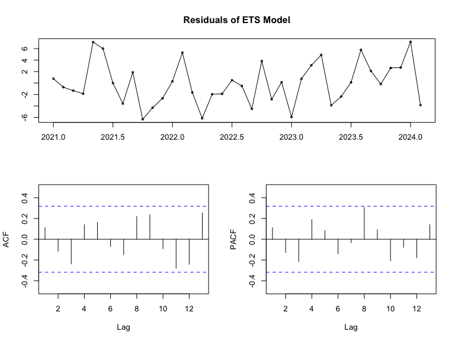<!-- -->
The residuals of the ETS model seems randomly scattered around 0, without any visible pattern.
This indicates that the model has appropriately captured the underlying trends in the data.
However, there are some peaks and dips in the residuals that might suggest minor variations not captured by the model.
As also the not so low MSE suggests, the model is not perfect but it is the best we can get.

The ACF and PACF of the residuals reveal whether the residuals are uncorrelated and resemble white noise. 
In this case, most lags fall within the confidence intervals, indicating that the residuals exhibit minimal autocorrelation. 
This is a good sign as it suggests the ETS model is adequately modeling the data without leaving behind systematic errors.

Finally we plot the predicted values and the actual ones.

``` r
ggplot() +
  geom_line(aes(x = data$Date, y = data$Baccala_Mantecato, color = "Actual Values"), size = 1) +
  geom_line(aes(x = train$Date, y = fitted(fit_ES_m), color = "Train Fitted Values (ETS)"), size = 1) +
  geom_line(aes(x = test$Date, y = forecast(fit_ES_m, h = nrow(test))$mean, 
                color = "Test Predicted Values (ETS)"), size = 1) +
  labs(
    title = "Time Series: Actual vs Predicted Values - Baccalà Mantecato\nETS Model",
    x = "Date",
    y = "Value",
    color = "Legend"
  ) +
  theme_minimal() +
  theme(legend.position = "bottom", text = element_text(size = 12))
```

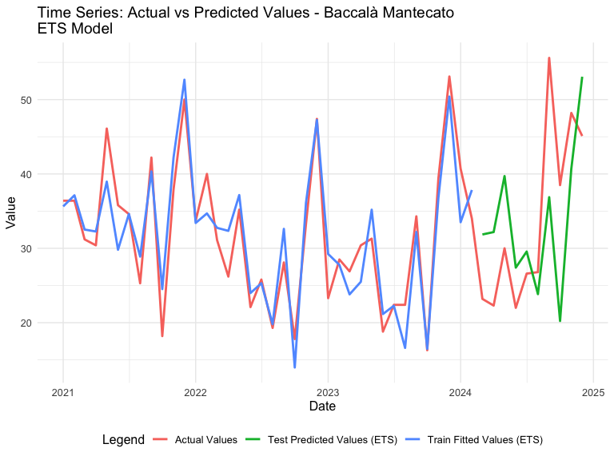<!-- -->
As we can see from the plot the blue line representing the fitted values during the training phase closely follows the red line of actual values, which indicates that the ETS model is performing well in capturing the data''s behavior during training.
The Exponential Smoothing model is able to capture the underlying trends in the data,the predicted values (Green Line) are close to the actual ones, and the model seems to be a good fit for the data, though it shows some deviation during more extreme values.


#### Baccala Vicentina

Now we do the same also for the Baccala Vicentina series

``` r
results_v <- data.frame(
  Model = character(),
  MSE = numeric(),
  AIC = numeric(),
  stringsAsFactors = FALSE
)

train_series_v <- ts(train$Baccala_Vicentina, start = c(2021, 1), frequency = 12)
```

ETS Model

``` r
fit_ES_v <- ets(train_series_v)
forecast_ES_v <- forecast(fit_ES_v, h = length(y_testv))
mse_ets_v <- mse(forecast_ES_v$mean, y_testv)
aic_ets_v <- AIC(fit_ES_v)
results_v <- rbind(results_v, data.frame(Model = "ETS", MSE = mse_ets_v, AIC = aic_ets_v))
```

With the initial exponential smoothing model we obtained a really good MSE of 1.475781 and an AIC of 105.6035,
and these are already good results.
However, we also try the ETS model with additive and multiplicative seasonality to see if we 
can improve the already results.

Holt-Winters Additive Seasonality (via ETS)

``` r
fit_hw_add_v <- ets(train_series_v, model = "AAA")
forecast_hw_add_v <- forecast(fit_hw_add_v, h = length(y_testv))
mse_hw_add_v <- mse(forecast_hw_add_v$mean, y_testv)
aic_hw_add_v <- AIC(fit_hw_add_v)
results_v <- rbind(results_v, data.frame(Model = "Holt-Winters Additive", MSE = mse_hw_add_v, AIC = aic_hw_add_v))
```

Including additive seasonality doesn’t improve the results obtained with the classic ETS model, since the MSE is 1.512441 and the AIC is 111.4078.

Holt-Winters Multiplicative Seasonality (via ETS)

``` r
fit_hw_mult_v <- ets(train_series_v, model = "MAM")
forecast_hw_mult_v <- forecast(fit_hw_mult_v, h = length(y_testv))
mse_hw_mult_v <- mse(forecast_hw_mult_v$mean, y_testv)
mse_hw_mult_v_train <- mse(fitted(fit_hw_mult_v), train$Baccala_Vicentina)
aic_hw_mult_v <- AIC(fit_hw_mult_v)
results_v <- rbind(results_v, data.frame(Model = "Holt-Winters Multiplicative", MSE = mse_hw_mult_v, AIC = aic_hw_mult_v))
```

Including multiplicative seasonality instead, slightly improve the obtained MSE reducing it to 1.434768, on the other hand it increases the AIC to 109.9921.

``` r
print(results_v)
```

```
##                         Model      MSE      AIC
## 1                         ETS 1.475781 105.6035
## 2       Holt-Winters Additive 1.512441 111.4078
## 3 Holt-Winters Multiplicative 1.434768 109.9921
```
Since our goal is to minimize the MSE, we decide to keep the Holt-Winters with multiplicative seasonality which has the lowest MSE among the three models.

``` r
tsdisplay(residuals(fit_hw_mult_v), main = "Residuals of Holt-Winters Multiplicative Seasonality Model")
```

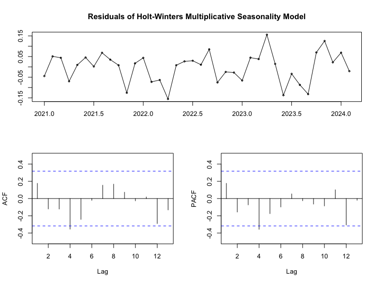<!-- -->

The residuals plot for the Holt-Winters Multiplicative Seasonality Model shows that the residuals are randomly distributed around zero, which is an indication of a good fit. 
The residuals do not exhibit any apparent pattern or seasonality, which means the model has effectively accounted for the multiplicative seasonal variations in the data.

The ACF and PACF for the residuals further confirm the randomness of the residuals. 
There are no significant spikes outside the confidence bands, suggesting that the residuals are uncorrelated and approximate white noise. 
This validates the model''s performance and confirms that it has captured the key elements of the time series.


``` r
ggplot() +
  geom_line(aes(x = data$Date, y = data$Baccala_Vicentina, color = "Actual Values"), size = 1) +
  geom_line(aes(x = train$Date, y = fitted(fit_hw_mult_v ), color = "Train Fitted Values (HWMS)"), size = 1) +
  geom_line(aes(x = test$Date, y = forecast(fit_hw_mult_v , h = nrow(test))$mean, 
                color = "Test Predicted Values (HWMS)"), size = 1) +
  labs(
    title = "Time Series: Actual vs Predicted Values - Baccalà Vicentina\nHolt-Winters Multiplicative Seasonality Model",
    x = "Date",
    y = "Value",
    color = "Legend"
  ) +
  theme_minimal() +
  theme(legend.position = "bottom", text = element_text(size = 12))
```

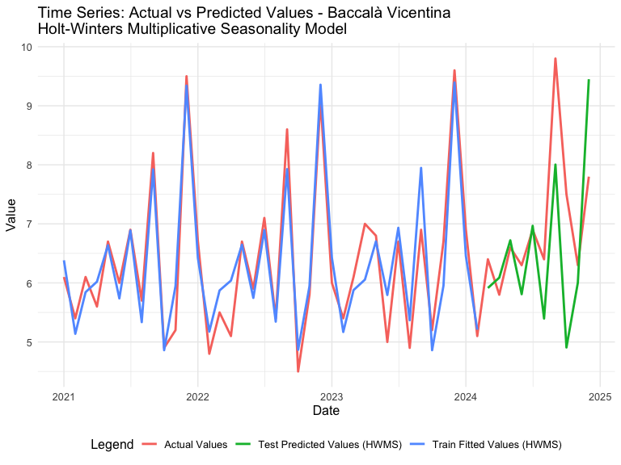<!-- -->
Looking to the plot we can see that the fitted values during the training period are well aligned with the actual values, demonstrating that the Holt-Winters model effectively captures the multiplicative seasonal behavior of the time series. 
However, the model's performance slightly deteriorates during the peaks and troughs, which is expected for such models.

In the test period, the green line representing the predicted values shows a good alignment with the actual values, maintaining the seasonal structure. 
Some underestimations occur during sharp spikes in the data, but overall, the model provides reliable forecasts.


## Results


``` r
name_models <- c("Linear Regression", "SARIMA", "Prophet", "SARIMAX", "Exponential Smoothing")

mse_train_m <- c(mse_train_lrm, mse_train_sarimam, mse_train_prm, mse_train_sarimaxm, mse_ets_m_train)
mse_train_v <- c(mse_train_lrv, mse_train_sarimav, mse_train_prv, mse_train_sarimaxv, mse_hw_mult_v_train)

mse_test_m <- c(mse_test_lrm, mse_test_sarimam, mse_test_prm, mse_test_sarimaxm, mse_ets_m)
mse_test_v <- c(mse_test_lrv, mse_test_sarimav, mse_test_prv, mse_test_sarimaxv, mse_hw_mult_v)

results <- data.frame(
  Model = name_models,
  
  MSE_Train_Mantecato = mse_train_m,
  MSE_Train_Vicentina = mse_train_v,
  
  MSE_Test_Mantecato = mse_test_m,
  MSE_Test_Vicentina = mse_test_v
)
results
```

<div data-pagedtable="false">
  <script data-pagedtable-source type="application/json">
{"columns":[{"label":["Model"],"name":[1],"type":["chr"],"align":["left"]},{"label":["MSE_Train_Mantecato"],"name":[2],"type":["dbl"],"align":["right"]},{"label":["MSE_Train_Vicentina"],"name":[3],"type":["dbl"],"align":["right"]},{"label":["MSE_Test_Mantecato"],"name":[4],"type":["dbl"],"align":["right"]},{"label":["MSE_Test_Vicentina"],"name":[5],"type":["dbl"],"align":["right"]}],"data":[{"1":"Linear Regression","2":"6.775488","3":"0.1879386","4":"45.59531","5":"1.512444"},{"1":"SARIMA","2":"29.757929","3":"0.3605396","4":"104.50500","5":"2.265000"},{"1":"Prophet","2":"9.229036","3":"0.1129688","4":"119.07301","5":"1.842281"},{"1":"SARIMAX","2":"14.297317","3":"0.3683188","4":"64.05571","5":"2.349442"},{"1":"Exponential Smoothing","2":"13.246196","3":"0.1936225","4":"111.79945","5":"1.434768"}],"options":{"columns":{"min":{},"max":[10]},"rows":{"min":[10],"max":[10]},"pages":{}}}
  </script>
</div>


``` r
plot_results(results, "MSE_Train_Mantecato")
```

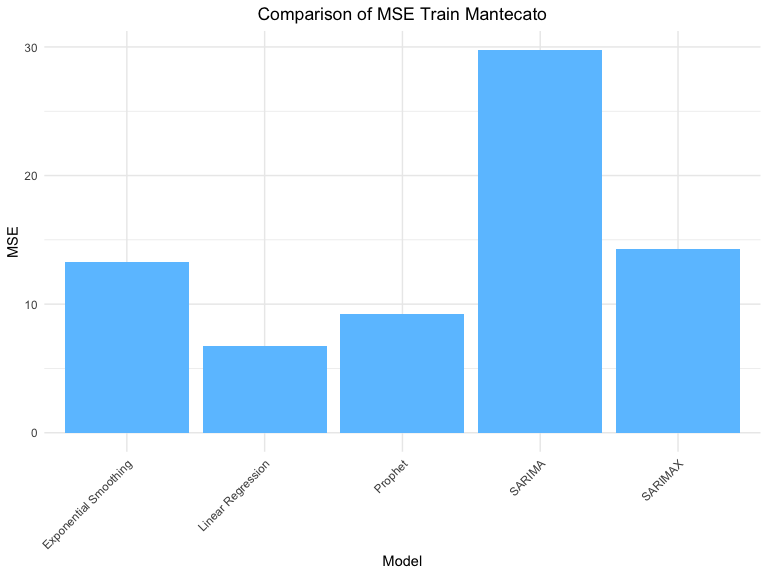<!-- -->

``` r
plot_results(results, "MSE_Test_Mantecato")
```

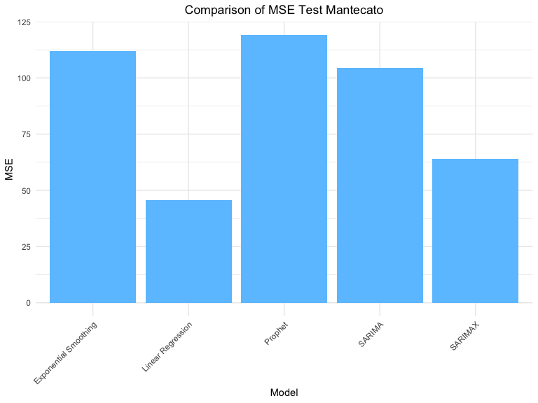<!-- -->

``` r
plot_results(results, "MSE_Train_Vicentina")
```

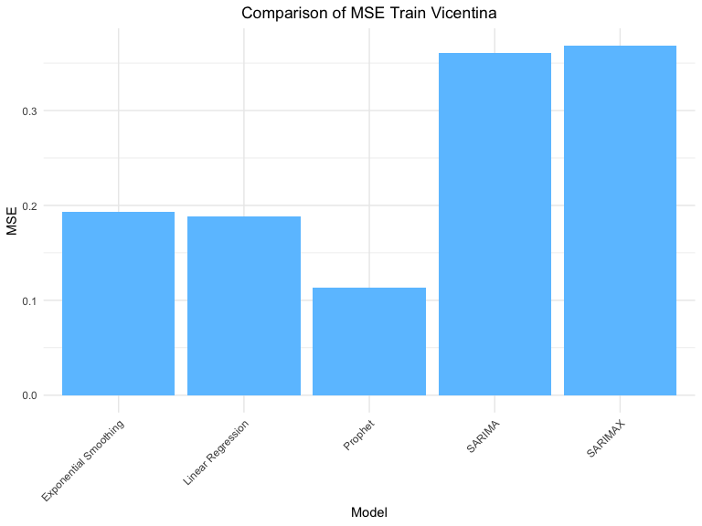<!-- -->

``` r
plot_results(results, "MSE_Test_Vicentina")
```

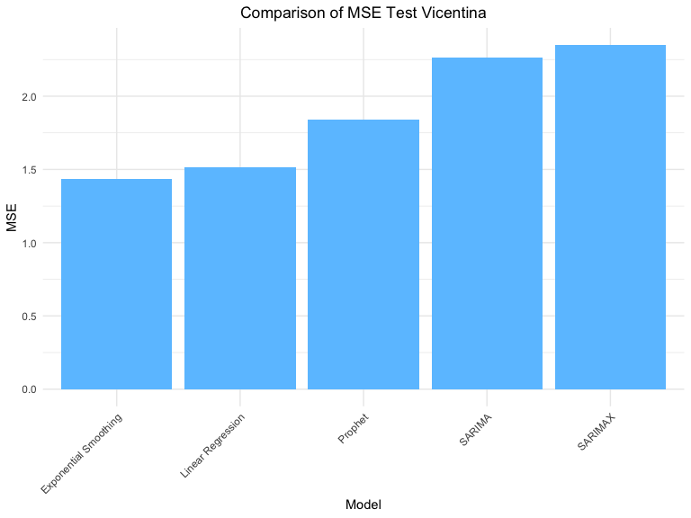<!-- -->


